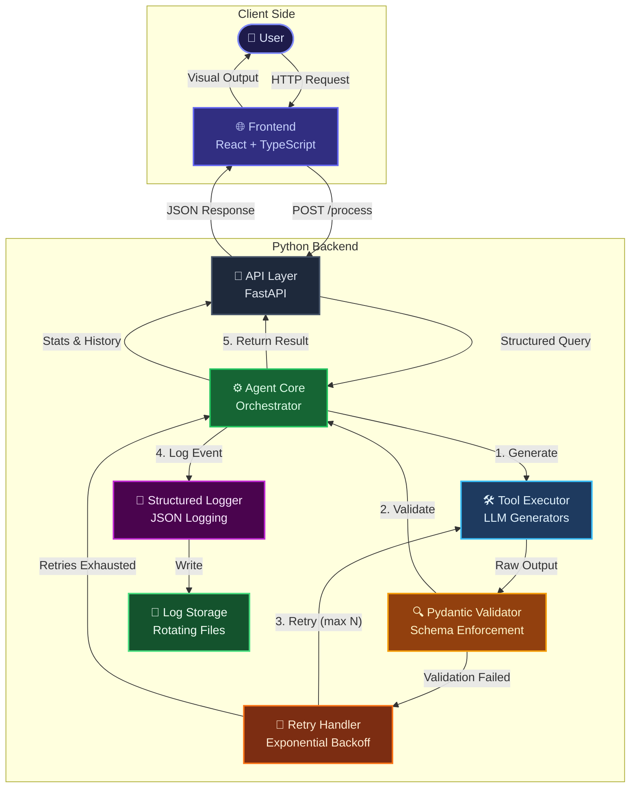
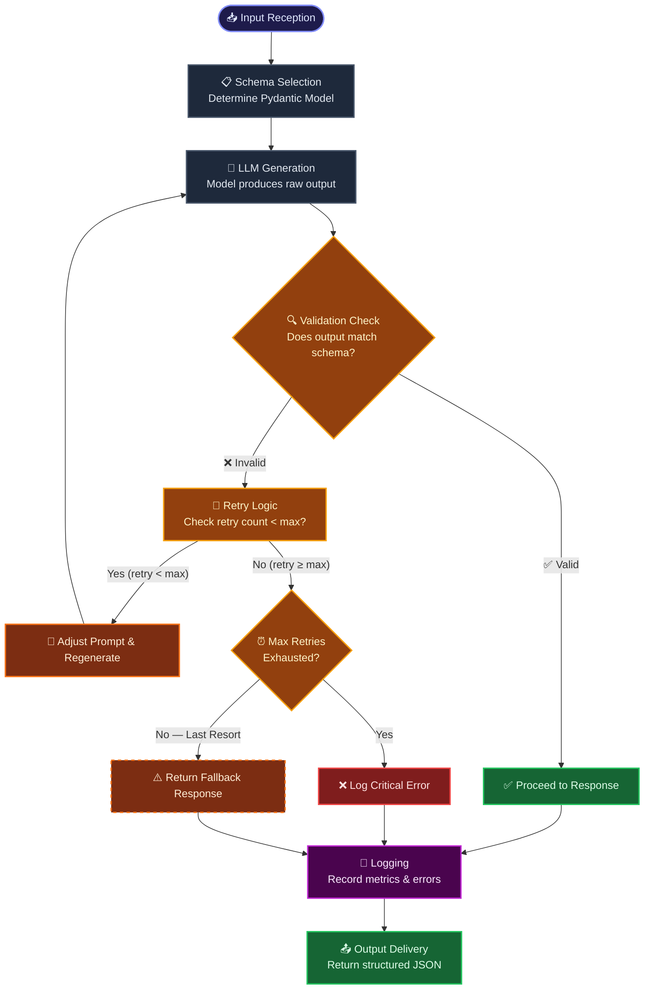
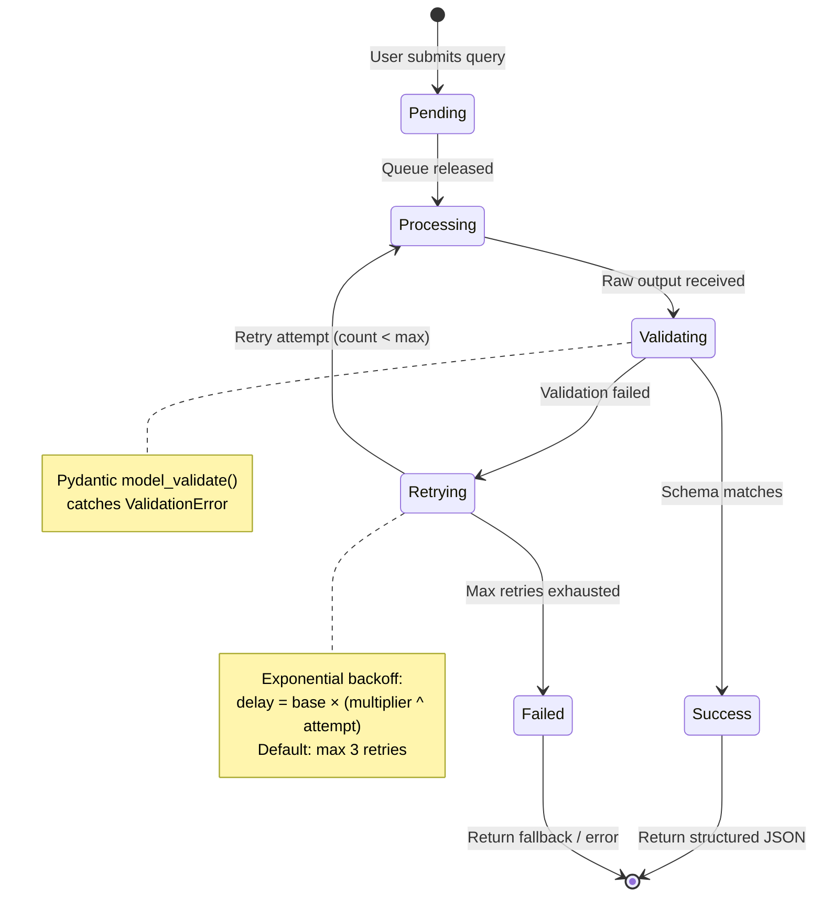

# 🧠 Structured Output Agent

> **Enforce strict Pydantic JSON schemas, validate tool responses, retry on parse errors, and log validation failures — a production-ready middleware for AI orchestration platforms.**

[](https://python.org)
[](https://fastapi.tiangolo.com)
[](https://docs.pydantic.dev)
[](https://react.dev)
[](https://www.typescriptlang.org)
[](LICENSE)

---

## 📋 Table of Contents

- [Overview](#-overview)
- [System Architecture](#%EF%B8%8F-system-architecture)
- [Processing Flowchart](#-processing-flowchart)
- [State Transition Diagram](#-state-transition-diagram)
- [Features](#-features)
- [Quick Start](#-quick-start)
  - [Prerequisites](#prerequisites)
  - [Backend Setup](#backend-setup)
  - [Frontend Setup](#frontend-setup)
  - [Docker Setup](#docker-setup)
- [Configuration](#-configuration)
- [API Reference](#-api-reference)
- [Schema Definitions](#-schema-definitions)
- [Project Structure](#-project-structure)
- [Troubleshooting](#-troubleshooting)
- [Contributing](#-contributing)
- [License](#-license)

---

## 📖 Overview

The **Structured Output Agent** is a modular, extensible system that enforces strict schema validation on AI model outputs. It sits between your LLM and your application, ensuring every response conforms to a predefined Pydantic schema before being processed further.

### Key Capabilities

- **Schema Enforcement** — Define complex, nested Pydantic models with field validators
- **Validation Pipeline** — Every output is validated against its expected schema
- **Automatic Retry** — Exponential backoff with configurable retry limits
- **Structured Logging** — JSON-formatted logs with request/response traceability
- **Fallback Handling** — Graceful degradation when all retries are exhausted
- **Interactive Demo** — Web UI to visually explore all features

---

## 🏗️ System Architecture

The following diagram illustrates the high-level system architecture and data flow between components:



---

## 🔄 Processing Flowchart

The detailed step-by-step lifecycle of a single request through the system:



---

## 🔁 State Transition Diagram

The states a request transitions through during its lifecycle:



---

## ✨ Features

### 🎯 Structured Output Enforcement
- Pydantic v2 `BaseModel` schemas with strict field validation
- Nested schemas, custom validators, and type hints
- `extra = "forbid"` rejects unknown fields
- Schema registry for dynamic lookup by name

### ✅ Validation Pipeline
- Validates every output before processing
- Detailed error reporting with field-level granularity
- Graceful handling of type errors, value errors, and structural mismatches
- Partial validation support for lenient mode

### 🔄 Retry Mechanism
- **Exponential backoff**: `delay = base × (multiplier ^ attempt)`
- Configurable max retries (default: 3, max: 10)
- Full async support via `execute_with_retry_async`
- Retry context passed to generators for adaptive regeneration

### 📝 Structured Logging
- JSON-formatted logs with timestamps, levels, and structured metadata
- Rotating file handler (10MB per file, 5 backups)
- Request/response IDs for full traceability
- Log query API for filtering by level, request ID, and time range

### 🌐 Interactive Demo UI
- Real-time structured JSON output display with syntax highlighting
- Visual schema viewer showing expected vs. actual output fields
- Retry attempt tracker with timing bars
- Live log viewer with level filtering
- Demo presets: Standard Success, Retry Once, Always Fails
- Export functionality for logs and responses

---

## 🚀 Quick Start

### Prerequisites

- **Python 3.10+**
- **Node.js 18+** (for frontend)
- **Bun** or **npm** (for frontend dependencies)

### Backend Setup

```bash
# Clone the repository
git clone https://github.com/Sarancoding/-Structured-Output-Agent.git
cd -Structured-Output-Agent

# Create virtual environment
python -m venv venv
source venv/bin/activate  # On Windows: venv\Scripts\activate

# Install dependencies
pip install -r requirements.txt

# Run the API server
python main.py
```

The API will be available at `http://localhost:8000`.

API documentation (Swagger UI): `http://localhost:8000/docs`

### Frontend Setup

```bash
cd frontend

# Install dependencies
bun install
# or: npm install

# Start development server
bun dev
# or: npm run dev
```

The frontend will be available at `http://localhost:5173`.

> **Note:** The Vite dev server proxies `/api` requests to `http://localhost:8000`. Make sure the backend is running.

### Docker Setup

```bash
# Build and run with Docker Compose
docker compose up --build
```

This starts both the backend API (`:8000`) and the frontend dev server (`:5173`).

---

## ⚙️ Configuration

### Environment Variables

| Variable | Default | Description |
|---|---|---|
| `HOST` | `0.0.0.0` | API server host |
| `PORT` | `8000` | API server port |
| `LOG_LEVEL` | `INFO` | Logging level (`DEBUG`, `INFO`, `WARNING`, `ERROR`, `CRITICAL`) |
| `RELOAD` | `false` | Enable hot reload for development |
| `CORS_ORIGINS` | `*` | Comma-separated allowed CORS origins |
| `VITE_API_URL` | `/api` | Frontend API proxy target |

### Agent Configuration

The agent can be configured programmatically via `AgentConfig`:

```python
from agent.schemas import AgentConfig

config = AgentConfig(
    max_retries=5,
    base_delay_seconds=2.0,
    backoff_multiplier=2.5,
    log_level="DEBUG",
    log_file="logs/agent.log",
    enable_structured_logging=True,
)
```

Or via the API:

```bash
curl -X POST http://localhost:8000/config \
  -H "Content-Type: application/json" \
  -d '{"max_retries": 5, "log_level": "DEBUG"}'
```

---

## 📚 API Reference

### `GET /health`
Health check endpoint.

**Response:** `{"status": "healthy"}`

### `POST /process`
Process a query through the structured output pipeline.

**Request Body:**
```json
{
  "query": "Analyze the impact of AI on healthcare",
  "generator": "mock_success",
  "schema": "TextAnalysis",
  "context": {}
}
```

**Response:**
```json
{
  "request_id": "abc-123",
  "success": true,
  "data": { ... },
  "validation_status": "success",
  "retry_attempts": 0,
  "attempt_details": [],
  "processing_time_ms": 45.2,
  "schema_used": "TextAnalysis",
  "timestamp": "2026-01-01T00:00:00"
}
```

### `POST /validate`
Validate raw data against a schema directly.

```json
{
  "raw_data": { "summary": "...", "entities": [] },
  "schema": "TextAnalysis"
}
```

### `GET /schemas`
List all available schemas.

### `GET /schemas/{name}`
Get detailed schema with field definitions.

### `GET /generators`
List registered generators.

### `GET /history?limit=10&status=success`
Get processing history.

### `GET /stats`
Get aggregate agent statistics.

### `GET /logs?level=ERROR&limit=50`
Read structured log entries.

### `POST /reset`
Reset agent state and statistics.

### `POST /config`
Update agent configuration parameters.

---

## 📐 Schema Definitions

### TextAnalysis

Full text analysis with entities, key points, and sentiment:

```python
class TextAnalysis(BaseModel):
    summary: str                              # Concise summary
    entities: List[Entity]                    # Named entities
    key_points: List[KeyPoint]                # Key extracted points
    sentiment: Optional[SentimentAnalysis]    # Sentiment analysis
    word_count: int                           # Total word count
    language: str                             # Detected language code
```

### Entity

```python
class Entity(BaseModel):
    name: str                                 # Entity name
    type: str                                 # Entity type (person, org, etc.)
    confidence: float                          # 0.0 to 1.0
```

### SentimentAnalysis

```python
class SentimentAnalysis(BaseModel):
    sentiment: Sentiment                      # positive, negative, neutral, mixed
    score: float                              # -1.0 to 1.0
    confidence: float                         # 0.0 to 1.0
```

### KeyPoint

```python
class KeyPoint(BaseModel):
    summary: str                              # Point summary
    relevance: float                          # 0.0 to 1.0
```

### ActionItem

```python
class ActionItem(BaseModel):
    description: str                          # Action description
    priority: str                             # low, medium, high, critical
    deadline: Optional[str]                   # ISO 8601 date
    assigned_to: Optional[str]                # Responsible party
```

---

## 📁 Project Structure

```
├── agent/                          # Python backend package
│   ├── __init__.py                 # Package initialization
│   ├── api.py                      # FastAPI endpoints & routing
│   ├── core.py                     # Agent orchestrator
│   ├── logger.py                   # Structured logging system
│   ├── retry.py                    # Exponential backoff retry handler
│   ├── schemas.py                  # Pydantic schema definitions
│   └── validator.py                # Response validation pipeline
│
├── frontend/                       # React + TypeScript frontend
│   ├── src/
│   │   ├── components/
│   │   │   ├── DemoPresets.tsx      # Scenario preset cards
│   │   │   ├── ExportButton.tsx     # JSON export functionality
│   │   │   ├── InputPanel.tsx       # Query input & controls
│   │   │   ├── LogViewer.tsx        # Live log display
│   │   │   ├── OutputDisplay.tsx    # Structured JSON output viewer
│   │   │   ├── RetryTracker.tsx     # Retry attempt visualization
│   │   │   ├── SchemaViewer.tsx     # Expected vs actual field viewer
│   │   │   └── StatusIndicator.tsx  # Request state indicator
│   │   ├── App.tsx                  # Main application component
│   │   ├── api.ts                   # API client
│   │   ├── index.css                # Tailwind CSS + custom styles
│   │   ├── main.tsx                 # React entry point
│   │   ├── types.ts                 # TypeScript type definitions
│   │   └── vite-env.d.ts            # Vite type declarations
│   ├── index.html
│   ├── package.json
│   ├── postcss.config.js
│   ├── tailwind.config.js
│   ├── tsconfig.json
│   └── vite.config.ts
│
├── logs/                           # Log output directory (gitignored)
├── Dockerfile                      # Multi-stage Docker build
├── docker-compose.yml              # Docker Compose configuration
├── main.py                         # Backend entry point
├── requirements.txt                # Python dependencies
├── .gitignore                      # Git ignore rules
└── README.md                       # This documentation
```

---

## 🔧 Troubleshooting

### Common Issues

| Issue | Solution |
|---|---|
| **`ModuleNotFoundError: No module named 'agent'`** | Run from the project root directory, or install the package: `pip install -e .` |
| **`Connection refused` on frontend** | Ensure the backend is running on `http://localhost:8000` |
| **CORS errors in browser** | Set `CORS_ORIGINS` env var to include your frontend URL |
| **Port already in use** | Use `PORT=8001 python main.py` to change the port |
| **No logs appearing** | Ensure `logs/` directory exists and is writable |
| **Validation always fails** | Check the generator is producing output that matches the schema structure |

### Logs

Logs are stored in `logs/agent.log` with automatic rotation (10MB per file, 5 backups).

To view logs:

```bash
# Tail in real-time
tail -f logs/agent.log | jq  # Requires jq for pretty-printing

# Filter for errors
grep '"ERROR"' logs/agent.log | jq

# Filter by request ID
grep '"request_id": "abc-123"' logs/agent.log | jq
```

### Debug Mode

```bash
LOG_LEVEL=DEBUG python main.py
```

---

## 🤝 Contributing

Contributions are welcome! Here's how you can help:

1. **Fork** the repository
2. **Create a feature branch**: `git checkout -b feature/amazing-feature`
3. **Commit your changes**: `git commit -m 'Add amazing feature'`
4. **Push to the branch**: `git push origin feature/amazing-feature`
5. **Open a Pull Request**

### Development Guidelines

- Write **type hints** for all Python code
- Add **Pydantic validators** for data integrity
- Ensure **all outputs conform** to defined schemas
- Write **descriptive commit messages**
- Add **tests** for new features
- Update **documentation** for API changes

### Code Style

- Python: Follow [PEP 8](https://peps.python.org/pep-0008/)
- TypeScript: Follow [TS Standard](https://github.com/standard/standard)
- Use meaningful variable names and add docstrings

---

## 📄 License

This project is licensed under the MIT License — see the [LICENSE](LICENSE) file for details.

---

<p align="center">
  Built with ❤️ using FastAPI, Pydantic, React, and TypeScript
  <br/>
  <sub>Structured Output Agent v1.0.0</sub>
</p>
